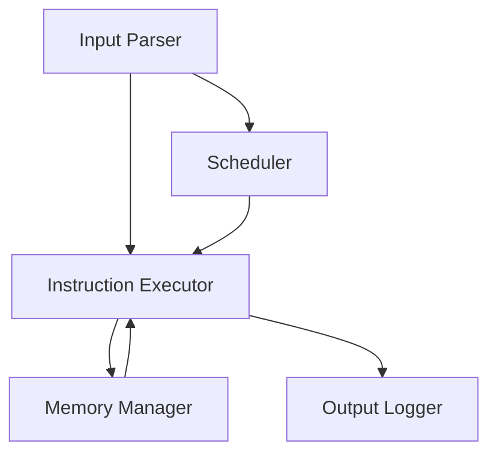

# 🧠 Virtual Memory Scheduler

**A C++ simulation of virtual memory management with process scheduling.**

This project models an operating system’s **memory management** and **job scheduling** system. It simulates virtual memory allocation, page handling, and execution of jobs based on instruction files.

---

## 📌 Project Overview

The **Virtual Memory Scheduler** performs the following:

* Simulates virtual memory with **fixed-size physical memory** and larger **virtual address space**.
* Handles **page allocation** and **deallocation**, including **page faults**.
* Implements **job scheduling** and executes instructions sequentially.
* Supports structured **input files** with job instructions and data sections.

This project demonstrates **operating system concepts**, **C++ programming skills**, and **problem-solving** in system-level simulations.

---

## ⚙️ Key Features

* **Virtual Memory Management**: Allocates and tracks pages in physical memory.
* **Process Scheduling**: Executes jobs sequentially or via round-robin.
* **Instruction Handling**: Supports LR, CR, BT, PD, H commands.
* **File I/O**: Reads job instructions and data from structured input files.
* **Output Logging**: Detailed execution logs for each instruction and job.

---

## 🧩 System Architecture

**Modules:**

| Module                   | Functionality                                                            |
| ------------------------ | ------------------------------------------------------------------------ |
| **Input Parser**         | Parses `$AMJ`, `$DTA`, `$END` sections and instructions.                 |
| **Instruction Executor** | Executes instructions: LR, CR, BT, PD, H. Updates memory/register state. |
| **Memory Manager**       | Tracks physical memory, allocates pages, handles page faults.            |
| **Scheduler**            | Manages execution order of multiple jobs.                                |
| **Output Logger**        | Prints results and job completion status.                                |

---

### 🖼️ Flow Diagram



*Figure: Data flow and execution flow in the Virtual Memory Scheduler.*

---

## 📄 Sample Input (`input.txt`)

```
$AMJ000100100050
LR05
CR06
BT08
PD05
H
$DTA
DATA
MORE
$END0001
```

---

## 🧪 Sample Output

```
Processing Job: 000100100050
Instruction LR05 executed: Loaded into register 5
Instruction CR06 executed: Compared with register 6
Instruction BT08 executed: Branching to instruction 8
Instruction PD05 executed: Printing data from register 5
Instruction H executed: Job halted
Data section loaded:
  DATA
  MORE
Job 000100100050 completed successfully
```

---

## 🚀 How to Run

### Prerequisites

* C++ Compiler (g++)
* Make

### Steps

1. Clone the repository:

```bash
git clone https://github.com/pratyaksh26/virtual-memory-scheduler.git
```

2. Navigate to the project directory:

```bash
cd virtual-memory-scheduler
```

3. Compile the project:

```bash
make
```

4. Run the simulation:

```bash
./virtual_memory_scheduler
```

5. Provide your input file (e.g., `input.txt`) as prompted.

---

## 🛠️ Future Enhancements

* Implement **page replacement algorithms** (LRU, FIFO, Optimal).
* Add support for **concurrent job scheduling**.
* Develop **GUI** for memory allocation visualization.
* Expand instruction set and branching logic.

---


